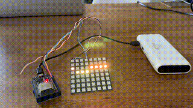
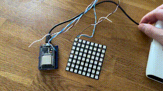
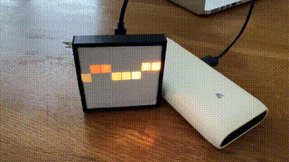

# MQTT Power Consumption Visualiser

This project visualizes power consumption using an ESP32 and a NeoPixel LED strip. The data is received via MQTT and displayed on an 8x8 LED matrix.

## Prerequisites

- ESP32 development board (ESP32S2)
- NeoPixel LED strip with 64 LEDs (CJMCU 8\*8 LED)
- PlatformIO
- Arduino Framework
- MQTT Broker feed with data from [Volkszaehler GitHub](https://github.com/volkszaehler/volkszaehler.org)

## Installation

1. Clone the repository:

   ```bash
   git clone https://github.com/D3V370P3R/MQTT-POWER-CONSUMPTION-VISUALISER-8x8.git
   cd MQTT-POWER-CONSUMPTION-VISUALISER-8x8
   ```

2. Install the dependencies:

   ```bash
   platformio run
   ```

3. Configure your WiFi and MQTT settings in the `config.h` file:
   ```cpp
   // config.h
   const char ssid[] = "your-SSID"
   const char password[] = "your-PASSWORD"
   const char mqtt_server[] = "your-MQTT-SERVER"
   const char loginMQTT[] = "your-MQTT-LOGIN"
   const char passwordMQTT[] = "your-MQTT-PASSWORD"
   const char MQTT_CurrentPowerConsumptionTopic[] = "your/MQTT/topic"
   ```

> [!NOTE]
> Please note that you must deactivate the dummy configuration if you use your personal data: `#define USE_DUMMY_CONFIG 0`

> [!WARNING]
> Never upload secret access data!

## Usage

1. Connect the NeoPixel LED strip to the ESP32.
2. Upload the code to the ESP32 board:
   ```bash
   platformio upload
   ```
3. Open the serial monitor to see the connection status messages:
   ```bash
   platformio monitor
   ```

## Example Videos

Live example with hair dryer as enery consumer</br>


Example of booting sequence with symbols and icons</br>


Example in a 3d printed case </br>


## CI/CD

This project uses GitHub Actions for continuous integration. The configuration file is located at `.github/workflows/ci.yml`.

## License

This project is licensed under the MIT License. For more information, see the `LICENSE` file.
